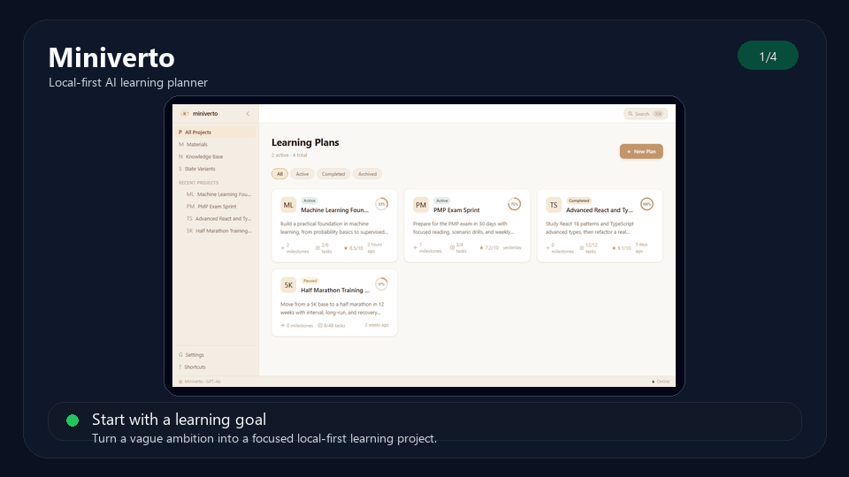
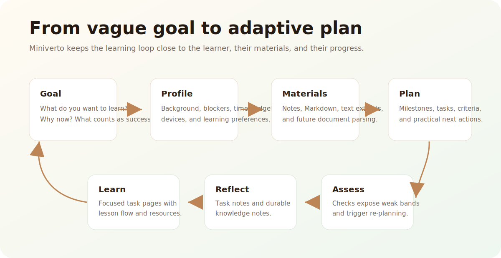
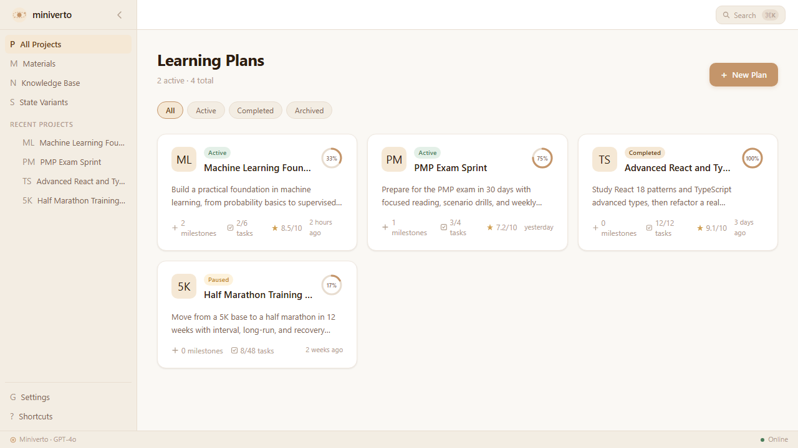
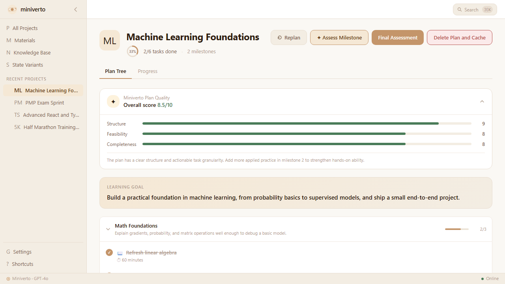
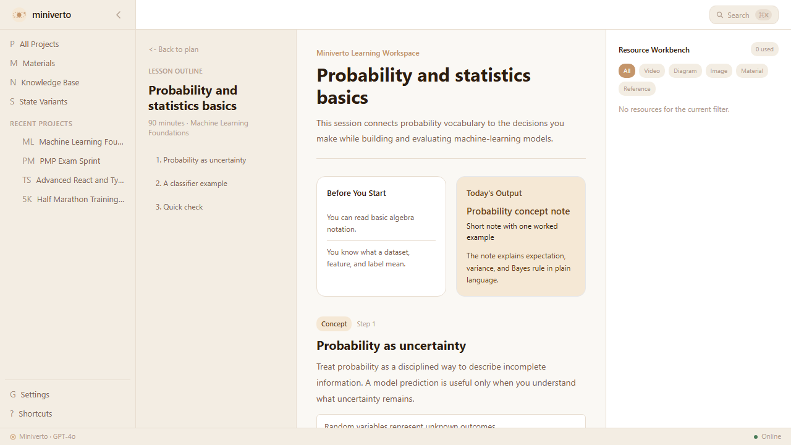
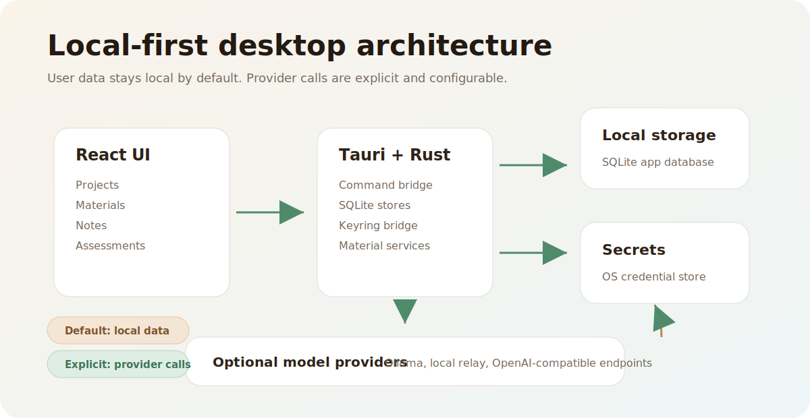

# Miniverto

[](https://github.com/shuangtao-eng/miniverto/actions/workflows/ci.yml)
[](LICENSE)
[](https://github.com/shuangtao-eng/miniverto/releases)

**Language:** English | [简体中文](README.zh-CN.md)

Miniverto is a local-first AI learning planner that turns ambitious learning goals into adaptive study plans, structured lessons, practice loops, and durable notes.

Most learning tools start after you already know what to study. Miniverto starts earlier: it helps you shape a vague goal, connect it to your background and available materials, then turn that context into a plan you can actually follow.

> Status: alpha. Miniverto is usable for local planning experiments and open-source collaboration, but it is not a polished consumer release yet.



## Why Miniverto

Learning breaks down when the plan is too generic, too long, or disconnected from what you already know. Miniverto is designed around a different loop:

1. Define the goal and current starting point.
2. Add learning materials or constraints.
3. Generate a practical plan with milestones and task-level outcomes.
4. Learn through focused task pages, notes, and assessments.
5. Re-plan when your understanding changes.

The product thesis is simple: a good learning app should feel less like a static syllabus and more like a private tutor that remembers your context.



## What It Can Do Today

- Create structured learning projects with milestones and tasks.
- Collect learner profile signals such as background, time budget, devices, blockers, and preferred learning methods.
- Generate deterministic in-app plans when a live model endpoint is not available.
- Call frontend-accessible OpenAI-compatible local endpoints such as Ollama or a local relay when configured.
- Store project data, learning materials, notes, assessments, and provider settings locally with SQLite.
- Store API keys in the operating system credential store through Tauri commands.
- Ingest plain text and Markdown materials into a local material library.
- Track task progress, task notes, knowledge notes, and assessment results.
- Run frontend and Rust test suites for the current core behavior.

## Product Screens







## Alpha Reality

Miniverto is intentionally public before it is finished. The current repository is best for people who want to inspect, run, improve, or fork the direction.

Known limitations:

- Windows is the verified desktop development target right now.
- macOS and Linux support are expected from the Tauri architecture, but they need platform-specific validation, especially around keyring integration.
- The settings screen has provider configuration and key storage, but its "test connection" flow is currently a UI-level success simulation.
- End-to-end cloud-model generation through stored API keys is not fully wired yet. If a key-protected cloud provider is selected, the app currently falls back to deterministic in-app plan generation.
- Material parsing is implemented for text and Markdown. PDF, slides, and audio are classified but not fully parsed yet.
- Security hardening, release signing, and installer distribution are roadmap items.

## Privacy Model

Miniverto is built as a local-first desktop app.

- App data is stored locally in SQLite.
- API keys are stored through the OS credential store, not in the project database.
- Materials are kept local by default.
- When live model calls are enabled, selected planning context may be sent to the configured model provider. Users should review their provider endpoint and privacy expectations before sending sensitive material.

## Tech Stack

- Frontend: React, TypeScript, Vite, Tailwind CSS, TanStack Router, Zustand, Vitest.
- Desktop shell: Tauri 2.
- Native layer: Rust, rusqlite, keyring.
- Storage: local SQLite plus OS credential store for secrets.



## Getting Started

Prerequisites:

- Node.js 22 or newer.
- npm 11 or newer.
- Rust stable toolchain.
- Windows is currently the verified desktop target.

Install dependencies:

```bash
npm ci
```

Run the web UI in development mode:

```bash
npm run dev
```

Run the Tauri desktop app:

```bash
npm run tauri:dev
```

If a clean clone does not start as expected, see [Troubleshooting Clean-Clone Setup](docs/TROUBLESHOOTING.md).

Run the checks:

```bash
npm run check
```

Build the frontend:

```bash
npm run build
```

Build the desktop app:

```bash
npm run tauri:build
```

## Repository Structure

```text
src/              React application, product flows, services, state, tests
src-tauri/        Tauri app, Rust commands, SQLite stores, keyring bridge
public/           Static assets
docs/             Product, roadmap, architecture, and GitHub publishing notes
.github/          CI workflow and contribution templates
```

## Product Direction

Miniverto is moving toward a private learning operating system:

- Local-first by default.
- Model-provider flexible.
- Built around actual learning loops, not just task lists.
- Honest about uncertainty, progress, review, and re-planning.

See [docs/ROADMAP.md](docs/ROADMAP.md) for the near-term plan.

## Story and Launch Materials

- Product story: [Why I built Miniverto, a local-first AI learning planner with Tauri and Rust](docs/articles/why-local-first-ai-learning-planner.md).
- Launch kit: [docs/LAUNCH_KIT.md](docs/LAUNCH_KIT.md).
- Demo media notes: [docs/DEMO_MEDIA.md](docs/DEMO_MEDIA.md).

## Contributing

Contributions are welcome while the project is still small enough to shape. Good first areas include:

- Cloud model runtime wiring through the native keyring path.
- macOS and Linux validation.
- PDF and document ingestion.
- Better assessment and re-planning loops.
- Accessibility and keyboard-driven workflows.
- Security hardening for Tauri CSP and provider calls.

Please read [CONTRIBUTING.md](CONTRIBUTING.md) before opening a pull request.

## License

Apache-2.0. See [LICENSE](LICENSE).

The npm package is marked `private` to prevent accidental package publication. The source code in this repository is licensed under Apache-2.0.

Author: kevin tao.
